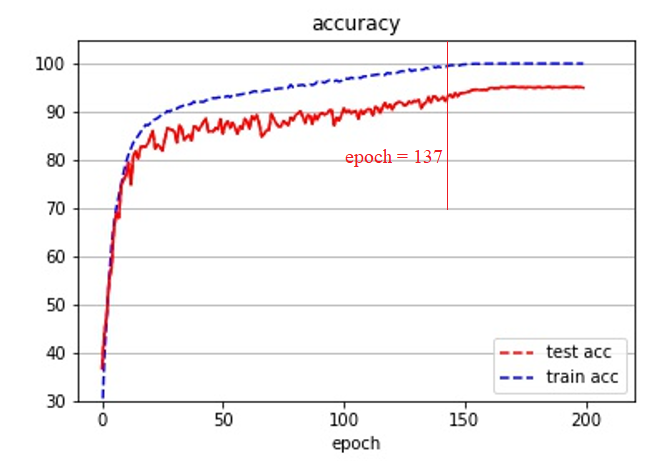
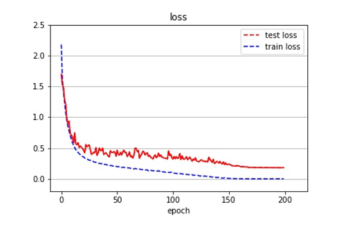

# cifra10_dl

选择深度学习框架： PyTorch

## 数据集：CIFAR-10 数据集

## baseline: resnet18

##Prerequisites

* Python 3.6+
* PyTorch 1.0+

## 模型介绍

本模型通过使用resnet18模型，在CIFAR-10 数据集上进行训练，以及超参数设计，进行了一系列实验。

具体代码详看 main.py 文件。

>实验设置随机种子，以便模型网络结构复现

## Training

```shell
python main.py --epoch=200 --lr=0.1  --batch_size=256
```

> 除 epoch, lr, batch_size 参数外，模型设置了额外参数，--resume 方便模型加载ckpt文件，继续训练

## 模型训练过程

1. 第一步，直接训练，按照默认参数

   | epoch | learningrate | batch_size |
   | :---: | :----------: | :--------: |
   |  200  |     0.1      |    256     |

   ```shell
   Epoch: 199
    [=========================== 196/196 ============================>]  Step: 29ms | Tot: 11s700ms | Loss: 0.002 | Acc: 100.000% (50000/50000)                                           
    [=========================== 100/100 ============================>]  Step: 10ms | Tot: 1s198ms | Loss: 0.181 | Acc: 94.980% (9498/10000)                                              
   训练结束，耗时 2694 s
   ```

   训练200个epoch 耗时 2694s， 最终已经在训练集上正确率达到了100%，在测试集上正确率达到了94.98%

2. 整理模型结果

   

   当训练到137代时，模型训练集上的正确率已经达到了100%, 而之后通过不断训练，模型在测试集上的正确率还在不断增加，正确率从92%增长到了95%。

   模型的loss曲线如下图所示：

   

   模型初期在训练集较大，迭代到 3-5 代时模型在训练集和测试集的 loss 已经开始保持一致。

   在第 20 代时，模型的 loss 值开始出现变化，在测试集上的 loss 变化很大，而在训练集上的变化则比较平稳；同时，loss 值在测试集上的大小明显要大于训练集的 loss.

   在 20-150 代区间的变化情况仍旧是 训练集变化平稳，测试集变化较大.

   模型在150代之后，训练集正确率到达100%，测试集正确率缓慢上升，loss值下降速度趋于0，不再发生明显的变化。

3. idea: 通过观察模型，发现模型在100代往后逐渐进入稳定的收敛过程，为探究学习率对稳定收敛的影响，我在100个epoch的情况下，加大学习率，设置为5倍默认学习率（即在scheduler模式下，扩大5倍学习率），在150个epoch时，重新调整学习率为默认学习率，观察实验结果。

